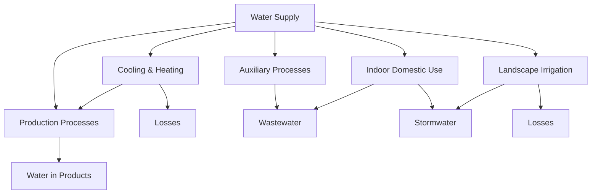

```mermaid
flowchart TD
    WS[Water Supply] --> CH[Cooling & Heating]
    WS --> PP[Production Processes]
    WS --> AP[Auxiliary Processes]
    WS --> IDU[Indoor Domestic Use]
    WS --> LI[Landscape Irrigation]
    
    CH --> L1[Losses]
    CH --> PP
    PP --> WIP[Water in Products]
    AP --> WW[Wastewater]
    IDU --> WW
    IDU --> SW[Stormwater]
    LI --> SW
    LI --> L2[Losses]
```
