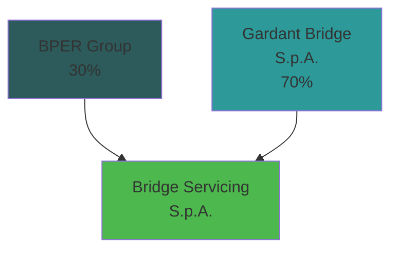

# UTP & BAD LOAN SERVICING PLATFORM

## SERVICING PLATFORM STOCK¹

**Gross claimed amount**
~ 2.2 €bn

**UTP Stock**
~ 1.2 €bn

**Bad Loan Stock**
~ 1.0 €bn

## 10-YEAR SERVICING AGREEMENT

| New UTP inflows | New Bad Loan inflows |
| --------------- | -------------------- |
| 50%             | 90%                  |

