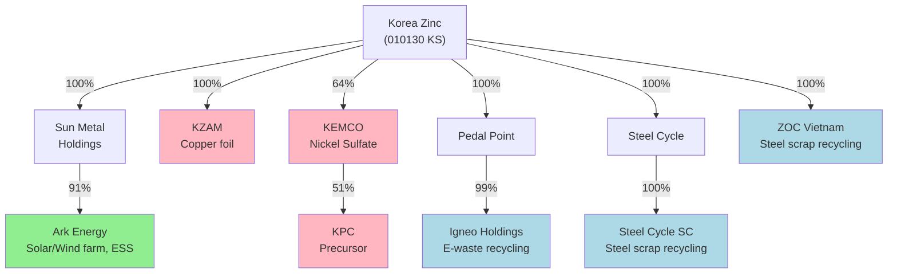

## Legend
- **Renewable Energy** (Green)
- **Battery Materials** (Red)  
- **Resource Recycling** (Blue)

## Korea Zinc Corporate Structure

```mermaid
flowchart TD
    KZ["Korea Zinc<br/>(010130 KS)"] --> |100%| SMH["Sun Metal<br/>Holdings"]
    KZ --> |100%| KZAM["KZAM<br/>Copper foil"]
    KZ --> |64%| KEMCO["KEMCO<br/>Nickel Sulfate"]
    KZ --> |100%| PP["Pedal Point"]
    KZ --> |100%| SC["Steel Cycle"]
    KZ --> |100%| ZOC["ZOC Vietnam<br/>Steel scrap recycling"]
    
    SMH --> |91%| AE["Ark Energy<br/>Solar/Wind farm, ESS"]
    KEMCO --> |51%| KPC["KPC<br/>Precursor"]
    PP --> |99%| IH["Igneo Holdings<br/>E-waste recycling"]
    SC --> |100%| SCSC["Steel Cycle SC<br/>Steel scrap recycling"]
    
    classDef renewable fill:#90EE90
    classDef battery fill:#FFB6C1
    classDef recycling fill:#ADD8E6
    
    class AE renewable
    class KZAM,KEMCO,KPC battery
    class ZOC,IH,SCSC recycling
```
