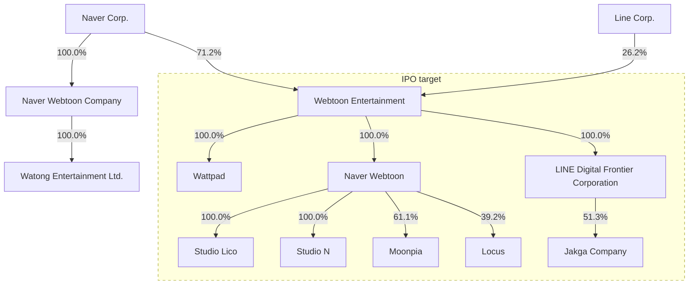

```mermaid
flowchart TD
    A[Naver Corp.] -->|100.0%| B[Naver Webtoon Company]
    A -->|71.2%| C[Webtoon Entertainment]
    D[Line Corp.] -->|26.2%| C
    
    B -->|100.0%| E[Watong Entertainment Ltd.]
    
    C -->|100.0%| F[Wattpad]
    C -->|100.0%| G[Naver Webtoon]
    C -->|100.0%| H[LINE Digital Frontier Corporation]
    
    G -->|100.0%| I[Studio Lico]
    G -->|100.0%| J[Studio N]
    G -->|61.1%| K[Moonpia]
    G -->|39.2%| L[Locus]
    H -->|51.3%| M[Jakga Company]
    
    subgraph IPO["IPO target"]
        C
        F
        G
        H
        I
        J
        K
        L
        M
    end
    
    style IPO stroke-dasharray: 5 5
```
