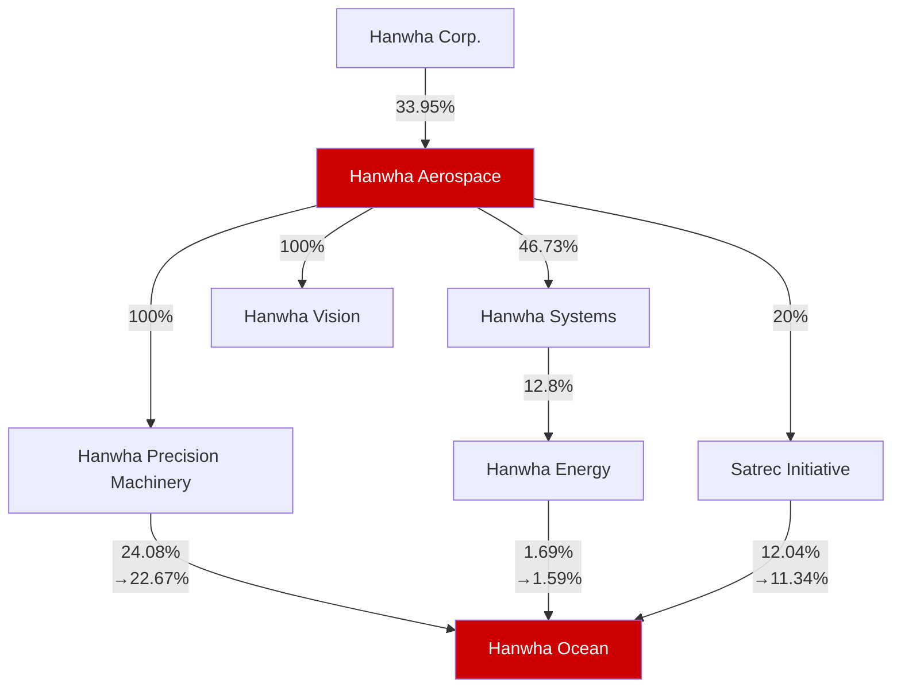

# Hanwha Corporate Structure

**Corporate Ownership Structure:**

| Parent Company             | Subsidiary                 | Ownership Percentage |
| -------------------------- | -------------------------- | -------------------- |
| Hanwha Corp.               | Hanwha Aerospace           | 33.95%               |
| Hanwha Aerospace           | Hanwha Systems             | 46.73%               |
| Hanwha Aerospace           | Hanwha Precision Machinery | 100%                 |
| Hanwha Aerospace           | Hanwha Vision              | 100%                 |
| Hanwha Aerospace           | Satrec Initiative          | 20%                  |
| Hanwha Systems             | Hanwha Energy              | 12.8%                |
| Hanwha Precision Machinery | Hanwha Ocean               | 24.08% (→22.67%)     |
| Hanwha Energy              | Hanwha Ocean               | 1.69% (→1.59%)       |
| Satrec Initiative          | Hanwha Ocean               | 12.04% (→11.34%)     |

*Note: Hanwha Aerospace and Hanwha Ocean are highlighted as key entities in the corporate structure. Percentages in parentheses with arrows (→) appear to represent adjusted or effective ownership percentages.*
