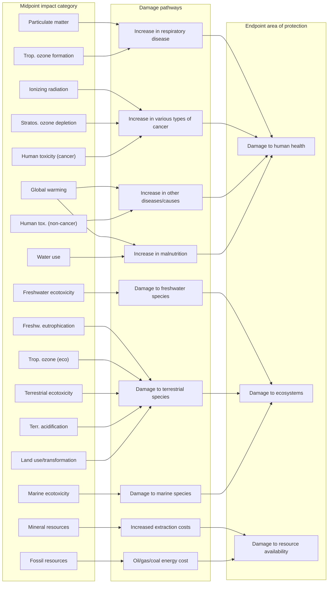

# Environmental Impact Assessment Framework

```mermaid
flowchart LR
    subgraph A["Midpoint impact category"]
        A1["Particulate matter"]
        A2["Trop. ozone formation"]
        A3["Ionizing radiation"]
        A4["Stratos. ozone depletion"]
        A5["Global warming"]
        A6["Water use"]
        A7["Human toxicity (cancer)"]
        A8["Human tox. (non-cancer)"]
        A9["Freshwater ecotoxicity"]
        A10["Freshw. eutrophication"]
        A11["Trop. ozone (eco)"]
        A12["Terrestrial ecotoxicity"]
        A13["Terr. acidification"]
        A14["Land use/transformation"]
        A15["Marine ecotoxicity"]
        A16["Mineral resources"]
        A17["Fossil resources"]
    end
    
    subgraph B["Damage pathways"]
        B1["Increase in respiratory disease"]
        B2["Increase in various types of cancer"]
        B3["Increase in other diseases/causes"]
        B4["Increase in malnutrition"]
        B5["Damage to freshwater species"]
        B6["Damage to terrestrial species"]
        B7["Damage to marine species"]
        B8["Increased extraction costs"]
        B9["Oil/gas/coal energy cost"]
    end
    
    subgraph C["Endpoint area of protection"]
        C1["Damage to human health"]
        C2["Damage to ecosystems"]
        C3["Damage to resource availability"]
    end
    
    A1 --> B1
    A2 --> B1
    A3 --> B2
    A4 --> B2
    A5 --> B3
    A5 --> B4
    A6 --> B4
    A7 --> B2
    A8 --> B3
    A9 --> B5
    A10 --> B6
    A11 --> B6
    A12 --> B6
    A13 --> B6
    A14 --> B6
    A15 --> B7
    A16 --> B8
    A17 --> B9
    
    B1 --> C1
    B2 --> C1
    B3 --> C1
    B4 --> C1
    B5 --> C2
    B6 --> C2
    B7 --> C2
    B8 --> C3
    B9 --> C3
```
