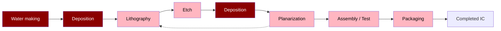

**Repeat many times** (feedback loop from Planarization back to Lithography)

**WAFER FAB PROCESS** (encompasses the process from Deposition through Planarization)

**ASM FOCUS IS ON DEPOSITION** (highlighting the two Deposition steps)
