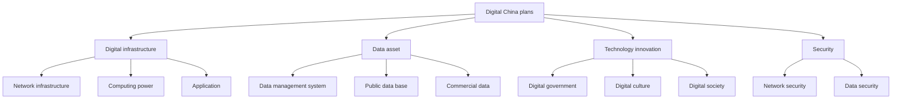

# Digital China Plans Structure

```mermaid
flowchart TD
    A[Digital China plans] --> B[Digital infrastructure]
    A --> C[Data asset]
    A --> D[Technology innovation]
    A --> E[Security]
    
    B --> F[Network infrastructure]
    B --> G[Computing power]
    B --> H[Application]
    
    C --> I[Data management system]
    C --> J[Public data base]
    C --> K[Commercial data]
    
    D --> L[Digital government]
    D --> M[Digital culture]
    D --> N[Digital society]
    
    E --> O[Network security]
    E --> P[Data security]
```
