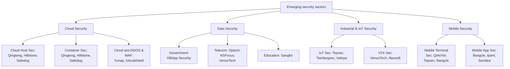

# Emerging security sectors

## Cloud Security

### Cloud Host Sec:
Qingteng, Hillstone, Safedog

### Container Sec:
Qingteng, Hillstone, Safedog

### Cloud anti-DDOS & WAF:
Yunaq, Icloudshield

## Data Security

### Government:
DBApp Security

### Telecom:
Dptech, NSFocus, VenusTech

### Education:
Sangfor

## Industrial & IoT Security

### IoT Sec:
Topsec, Tianfangsec, Iottepa

### V2X Sec:
VenusTech, Neusoft

## Mobile Security

### Mobile Terminal Sec:
QiAnXin, Topsec, Bangcle

### Mobile App Sec:
Bangcle, Ijiami, Secidea
