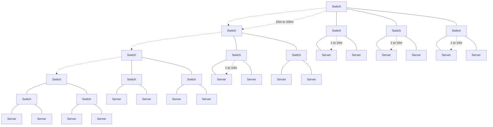

# Large AI clusters span 100s or 1000s of meters

```mermaid
graph TD
    A[Switch] -.-> B[Switch]
    B -.-> C[Switch] 
    C -.-> D[Switch]
    A --- E[Switch]
    A --- F[Switch]
    A --- G[Switch]
    B --- H[Switch]
    B --- I[Switch]
    C --- J[Switch]
    C --- K[Switch]
    D --- L[Switch]
    D --- M[Switch]
    E --- N[Server]
    E --- O[Server]
    F --- P[Server]
    F --- Q[Server]
    G --- R[Server]
    G --- S[Server]
    H --- T[Server]
    H --- U[Server]
    I --- V[Server]
    I --- W[Server]
    J --- X[Server]
    J --- Y[Server]
    K --- Z[Server]
    K --- AA[Server]
    L --- BB[Server]
    L --- CC[Server]
    M --- DD[Server]
    M --- EE[Server]
    
    A -.-> |10m to 100m| B
    E -.-> |1 to 10m| N
    F -.-> |1 to 10m| P
    G -.-> |1 to 10m| R
    H -.-> |1 to 10m| T
```

**Cluster Specifications:**
* 100s servers
* 100s switches  
* 1000s GPUs
* 1000s optics

## Network is the new bottleneck

2023

