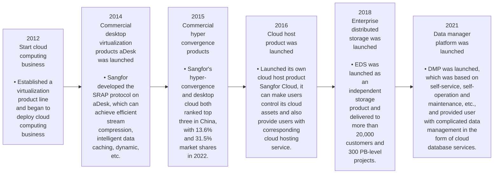

```mermaid
flowchart LR
    A["2012<br/>Start cloud<br/>computing<br/>business<br/><br/>• Established a<br/>virtualization<br/>product line<br/>and began to<br/>deploy cloud<br/>computing<br/>business"] --> B["2014<br/>Commercial<br/>desktop<br/>virtualization<br/>products aDesk<br/>was launched<br/><br/>• Sangfor<br/>developed the<br/>SRAP protocol on<br/>aDesk, which can<br/>achieve efficient<br/>stream<br/>compression,<br/>intelligent data<br/>caching, dynamic,<br/>etc."]
    
    B --> C["2015<br/>Commercial<br/>hyper<br/>convergence<br/>products<br/><br/>• Sangfor's<br/>hyper-<br/>convergence<br/>and desktop<br/>cloud both<br/>ranked top<br/>three in China,<br/>with 13.6%<br/>and 31.5%<br/>market shares<br/>in 2022."]
    
    C --> D["2016<br/>Cloud host<br/>product was<br/>launched<br/><br/>• Launched its own<br/>cloud host product<br/>Sangfor Cloud, it<br/>can make users<br/>control its cloud<br/>assets and also<br/>provide users with<br/>corresponding<br/>cloud hosting<br/>service."]
    
    D --> E["2018<br/>Enterprise<br/>distributed<br/>storage was<br/>launched<br/><br/>• EDS was<br/>launched as<br/>an<br/>independent<br/>storage<br/>product and<br/>delivered to<br/>more than<br/>20,000<br/>customers and<br/>300 PB-level<br/>projects."]
    
    E --> F["2021<br/>Data manager<br/>platform was<br/>launched<br/><br/>• DMP was launched,<br/>which was based on<br/>self-service, self-<br/>operation and<br/>maintenance, etc.,<br/>and provided user<br/>with complicated data<br/>management in the<br/>form of cloud<br/>database services."]
```
