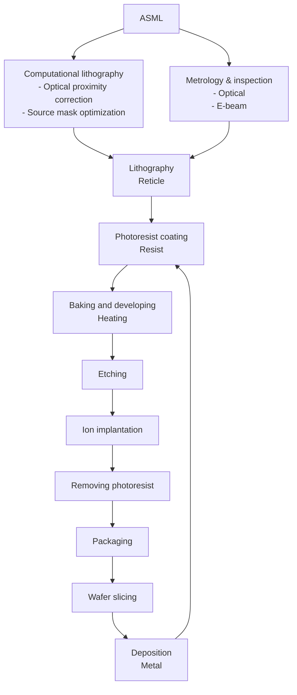

# ASML

```mermaid
flowchart TD
    A[ASML] --> B[Computational lithography<br/>- Optical proximity correction<br/>- Source mask optimization]
    A --> C[Metrology & inspection<br/>- Optical<br/>- E-beam]
    
    D[Lithography<br/>Reticle] --> E[Photoresist coating<br/>Resist]
    E --> F[Baking and developing<br/>Heating]
    F --> G[Etching]
    G --> H[Ion implantation]
    H --> I[Removing photoresist]
    I --> J[Packaging]
    J --> K[Wafer slicing]
    K --> L[Deposition<br/>Metal]
    L --> E
    
    B --> D
    C --> D
```
