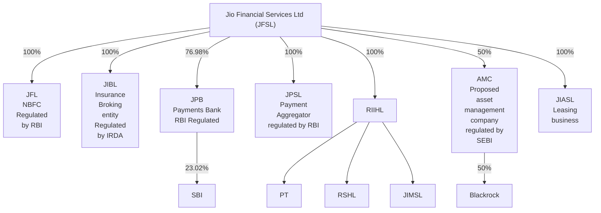

# Jio Financial Services Ltd (JFSL)

JFSL is a publicly listed entity (CIC¹) and acts as the holding company for the group

¹ Application for CIC has been filed with RBI

**Note:** JFL = Jio Finance Ltd., JIBL = Jio Insurance Broking Ltd., JPB = Jio Payments Bank, JPSL = Jio Payment Solutions Ltd., RIIHL = Reliance Industrial Investments and Holdings Ltd., AMC = Jio Information Solutions Ltd., PT = Petroleum Trust, RSHL = Reliance Strategic Holdings Ltd., JIMSL = Jio Infrastructure Management Services Ltd.

Jio Financial Services Limited | 10

