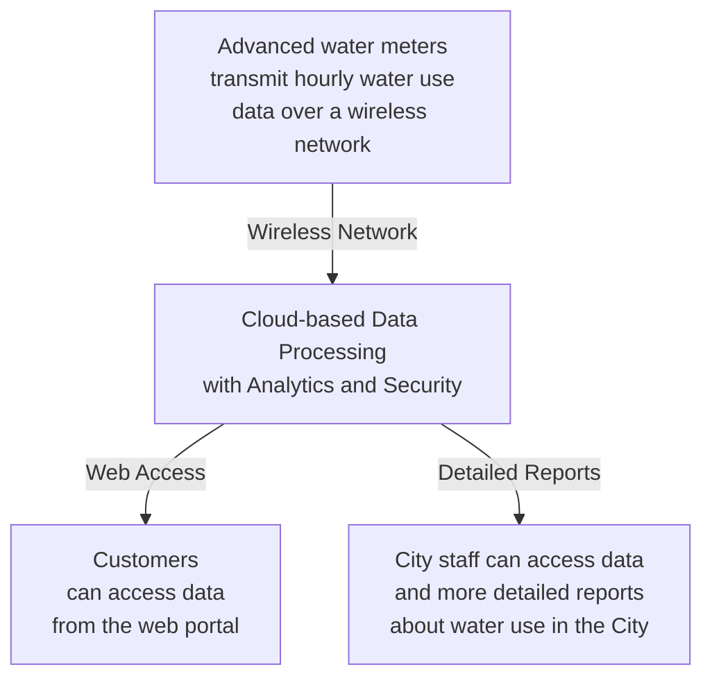

# How AMI works

An advanced metering system uses a wireless network to provide detailed data that is easily accessible online by customers and staff.

Advanced water meters transmit hourly water use data over a wireless network.

Customers can access data from the web portal.

City staff can access data and more detailed reports about water use in the City.
