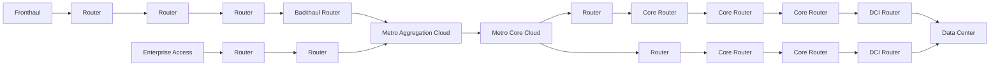

# Network Architecture Overview

## Product Categories and Models

| Fronthaul Gateway | Cell Site Router | Cell Site Router | Cell Site Router | Metro Access |
| ----------------- | ---------------- | ---------------- | ---------------- | ------------ |
| Monterey          | Qumran2c         | QumranAX         | QumranUX         | Jericho2     |

## Network Topology

## Component Mapping by Network Function

| uCPE        | OLT      | vBNG      | Metro Edge | Metro Core | DCI      | Data Center Spine | Data Center Leaf |
| ----------- | -------- | --------- | ---------- | ---------- | -------- | ----------------- | ---------------- |
| Trident3-X3 | QumranAX | Jericho2c | Jericho2   | Jericho2   | Jericho2 | Tomahawk4         | Trident3         |
| Trident3-X2 |          |           |            | Ramon      |          |                   | Trident4         |

