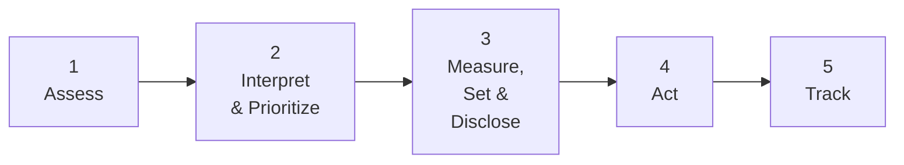

# 5-Step Process Framework

| Step 1Assess                                         | Step 2Interpret & Prioritize                                                                                          | Step 3Measure, Set & Disclose                                                                                                                 | Step 4Act                                                       | Step 5Track                         |
| ---------------------------------------------------- | --------------------------------------------------------------------------------------------------------------------- | --------------------------------------------------------------------------------------------------------------------------------------------- | --------------------------------------------------------------- | ----------------------------------- |
| • Materiality screening • Value chain assessment | • Determine target boundaries • Interpret & rank • Prioritize • Evaluate feasibility & strategic interest | • Model selection through stakeholder consultation • Measure baseline values • Determine maximum allowable pressure • Set targets | • Avoid • Reduce • Restore & Regenerate • Transform | • Monitor • Report • Verify |

