# Sora Technology Applications

```mermaid
graph TD
    A[Sora] --> B[Platform]
    A --> C[Enterprise]
    A --> D[Entertainment]
    A --> E[Professional]
    
    B --> B1[Short/Long Video]
    B --> B2[Search]
    B --> B3[Content Platform]
    B --> B4[Digital Media Platform]
    B --> B5[Social Media Platform]
    
    C --> C1[Healthcare]
    C --> C2[Auto]
    C --> C3[Robotics]
    
    D --> D1[Entertainment]
    D --> D2[Gaming]
    
    E --> E1[Education]
    E --> E2[Customer service]
    E --> E3[Productivity]
    E --> E4[Digital design]
    
    B1 --> B1a["Google, META, Tencent, Bytedance, Kuaishou, Bilibili, Xiao Hongshu"]
    B2 --> B2a["Google, Microsoft, OpenAI, Anthropic, Perplexity, POE, Moonshot"]
    B3 --> B3a["China Literature, CCL Group, Zhihu, Visual China Group"]
    B4 --> B4a["Netflix, Disney, Google, Amazon, Apple, iQiyi, Tencent, Alibaba (Youku)"]
    B5 --> B5a["META, Tencent, Xiao Hongshu"]
    
    C1 --> C1a["Ambience, Memora Health, DeepScribe, Hippocratic AI"]
    C2 --> C2a["Tesla, Xiaopeng, Huawei, Thundersoft, NavInfo"]
    C3 --> C3a["Tesla, Xiaomi, Boston Dynamics, Doosan Robotics, Ubtech"]
    
    D1 --> D1a["Character.ai, Inflection, Chai, Luzia, Tiktok"]
    D2 --> D2a["Dungeon, Leonardo AI, Unity, Roblox, Tencent, Netease"]
    
    E1 --> E1a["Speak, Elio, Study, Duolingo, TAL Edu group, iFlytek"]
    E2 --> E2a["Slang.ai, Genesys, Zendesk"]
    E3 --> E3a["Microsoft (CoPilot), Google (Duet AI), Notion, Kingsoft Office (WPS AI)"]
    E4 --> E4a["Adobe, Autodesk, Modfy, Picsart"]
```

## Platform

### Short/Long Video
Google, META, Tencent, Bytedance, Kuaishou, Bilibili, Xiao Hongshu

### Search
Google, Microsoft, OpenAI, Anthropic, Perplexity, POE, Moonshot

### Content Platform
China Literature, CCL Group, Zhihu, Visual China Group

### Digital Media Platform
Netflix, Disney, Google, Amazon, Apple, iQiyi, Tencent, Alibaba (Youku)

### Social Media Platform
META, Tencent, Xiao Hongshu

## Enterprise

### Healthcare
Ambience, Memora Health, DeepScribe, Hippocratic AI

### Auto
Tesla, Xiaopeng, Huawei, Thundersoft, NavInfo

### Robotics
Tesla, Xiaomi, Boston Dynamics, Doosan Robotics, Ubtech

## Entertainment

### Entertainment
Character.ai, Inflection, Chai, Luzia, Tiktok

### Gaming
Dungeon, Leonardo AI, Unity, Roblox, Tencent, Netease

## Professional

### Education
Speak, Elio, Study, Duolingo, TAL Edu group, iFlytek

### Customer service
Slang.ai, Genesys, Zendesk

### Productivity
Microsoft (CoPilot), Google (Duet AI), Notion, Kingsoft Office (WPS AI)

### Digital design
Adobe, Autodesk, Modfy, Picsart
