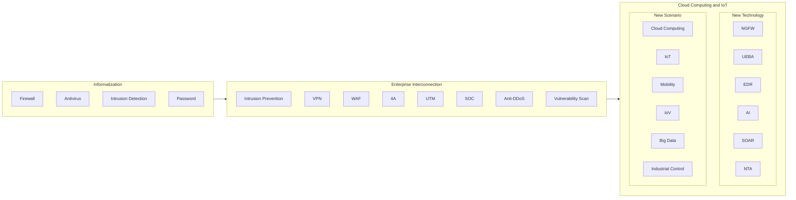

# Cybersecurity Technology Evolution

| Informatization                                                     | Enterprise Interconnection                                                                                       | Cloud Computing and IoT                                                                                                                                                                                       |
| ------------------------------------------------------------------- | ---------------------------------------------------------------------------------------------------------------- | ------------------------------------------------------------------------------------------------------------------------------------------------------------------------------------------------------------- |
| • Firewall • Antivirus • Intrusion Detection • Password | • Intrusion Prevention • VPN • WAF • 4A • UTM • SOC • Anti-DDoS • Vulnerability Scan | **New Technology:** • NGFW • UEBA • EDR • AI • SOAR • NTA  **New Scenario:** • Cloud Computing • IoT • Mobility • IoV • Big Data • Industrial Control |

