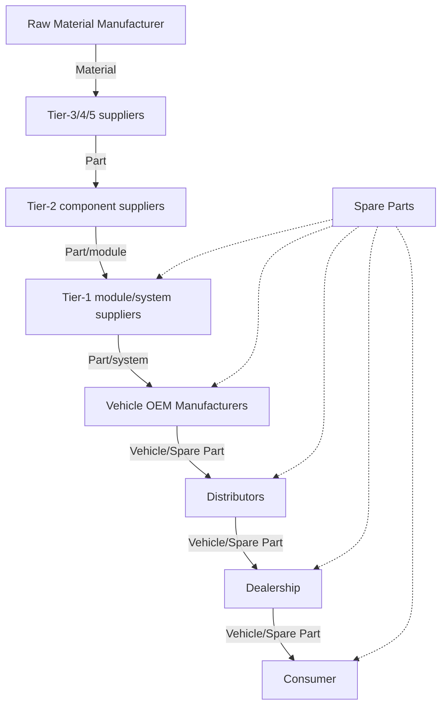

```mermaid
flowchart TD
    A[Raw Material Manufacturer] -->|Material| B[Tier-3/4/5 suppliers]
    B -->|Part| C[Tier-2 component suppliers]
    C -->|Part/module| D[Tier-1 module/system suppliers]
    D -->|Part/system| E[Vehicle OEM Manufacturers]
    E -->|Vehicle/Spare Part| F[Distributors]
    F -->|Vehicle/Spare Part| G[Dealership]
    G -->|Vehicle/Spare Part| H[Consumer]
    
    I[Spare Parts] -.-> D
    I -.-> E
    I -.-> F
    I -.-> G
    I -.-> H
```
