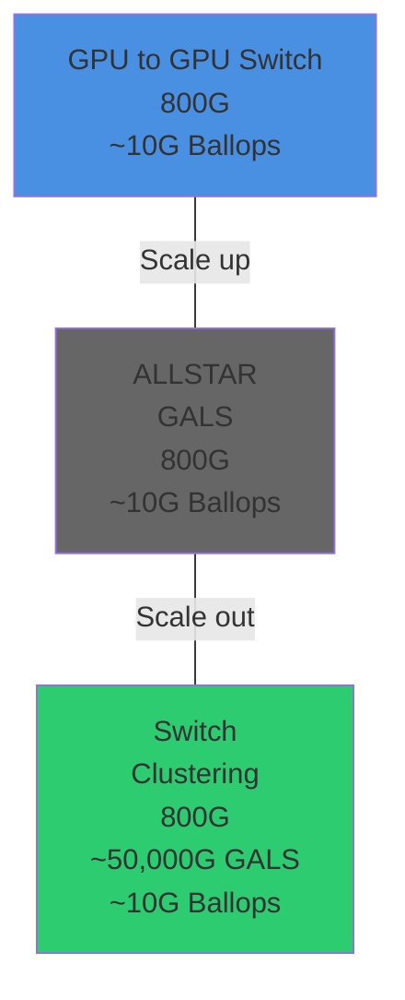

2023

# High-speed optics enable large AI clusters

| Network Layer     | Function               | Speed | Capacity                      |
| ----------------- | ---------------------- | ----- | ----------------------------- |
| GPU to GPU Switch | Scale up               | 800G  | \~10G Ballops                 |
| ALLSTAR GALS      | Intermediate switching | 800G  | \~10G Ballops                 |
| Clustering Switch | Scale out              | 800G  | \~50,000G GALS, \~10G Ballops |

