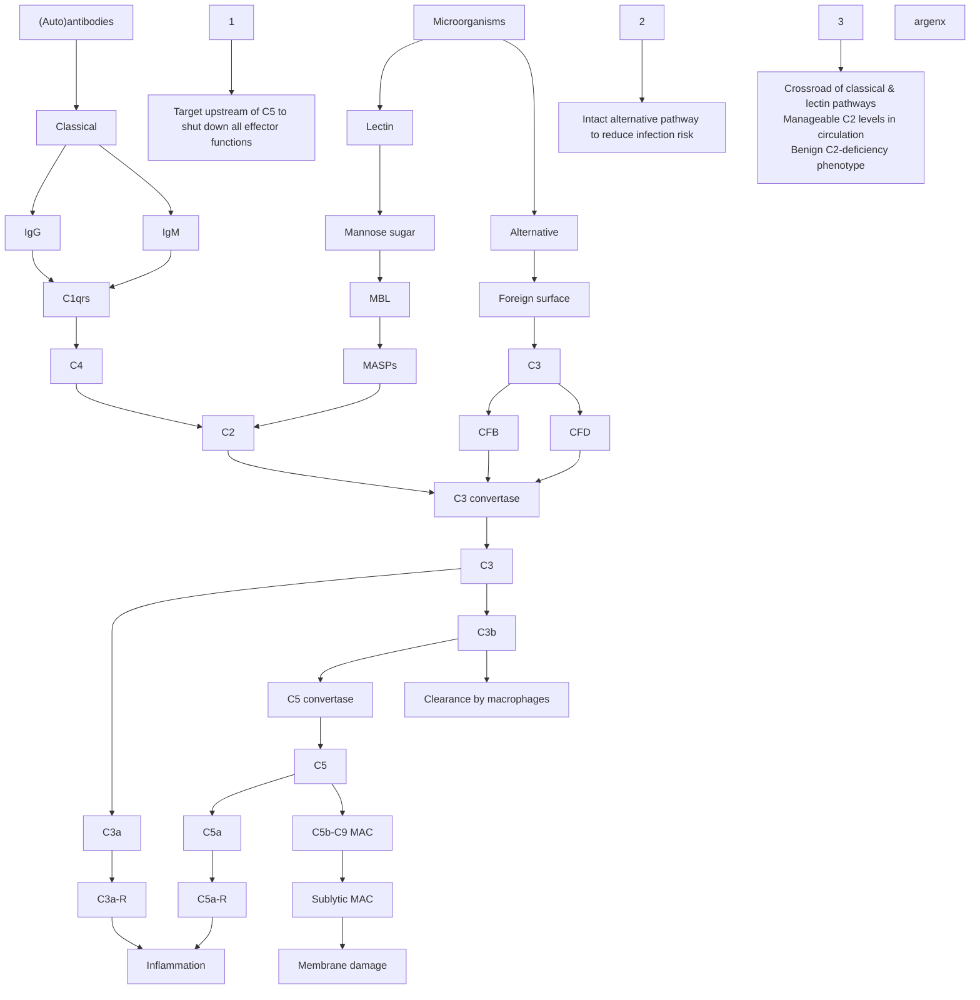

# Complement System Pathways

## Key Therapeutic Intervention Points

**1.** Target upstream of C5 to shut down all effector functions

**2.** Intact alternative pathway to reduce infection risk  

**3.** Crossroad of classical & lectin pathways
- Manageable C2 levels in circulation
- Benign C2-deficiency phenotype

## Pathway Components

### Classical Pathway
- Triggered by: (Auto)antibodies
- Components: IgG, IgM → C1qrs → C4 → C2

### Lectin Pathway  
- Triggered by: Microorganisms
- Components: Mannose sugar → MBL → MASPs → C2

### Alternative Pathway
- Triggered by: Microorganisms  
- Components: Foreign surface → C3 → CFB, CFD

## Downstream Effects

- **C3 convertase** → C3 → C3a, C3b
- **C5 convertase** → C5 → C5a, C5b-C9 MAC
- **C3a-R, C5a-R** → Inflammation
- **C3b** → Clearance by macrophages  
- **Sublytic MAC** → Membrane damage

argenx

