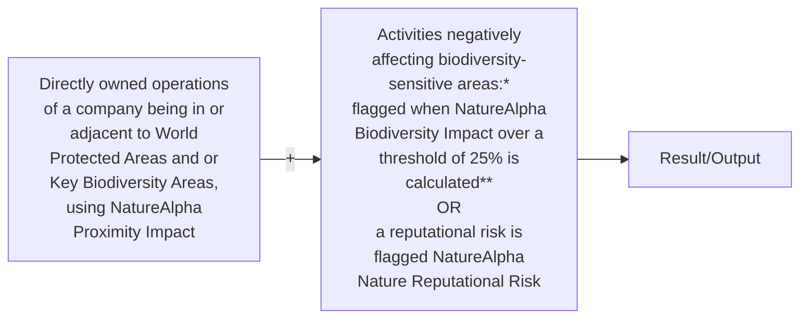

```mermaid
flowchart LR
    A["Directly owned operations<br/>of a company being in or<br/>adjacent to World<br/>Protected Areas and or<br/>Key Biodiversity Areas,<br/>using NatureAlpha<br/>Proximity Impact"] 
    B["Activities negatively<br/>affecting biodiversity-<br/>sensitive areas:*<br/>flagged when NatureAlpha<br/>Biodiversity Impact over a<br/>threshold of 25% is<br/>calculated**<br/>OR<br/>a reputational risk is<br/>flagged NatureAlpha<br/>Nature Reputational Risk"]
    C[Result/Output]
    
    A -->|+| B
    B --> C
```
