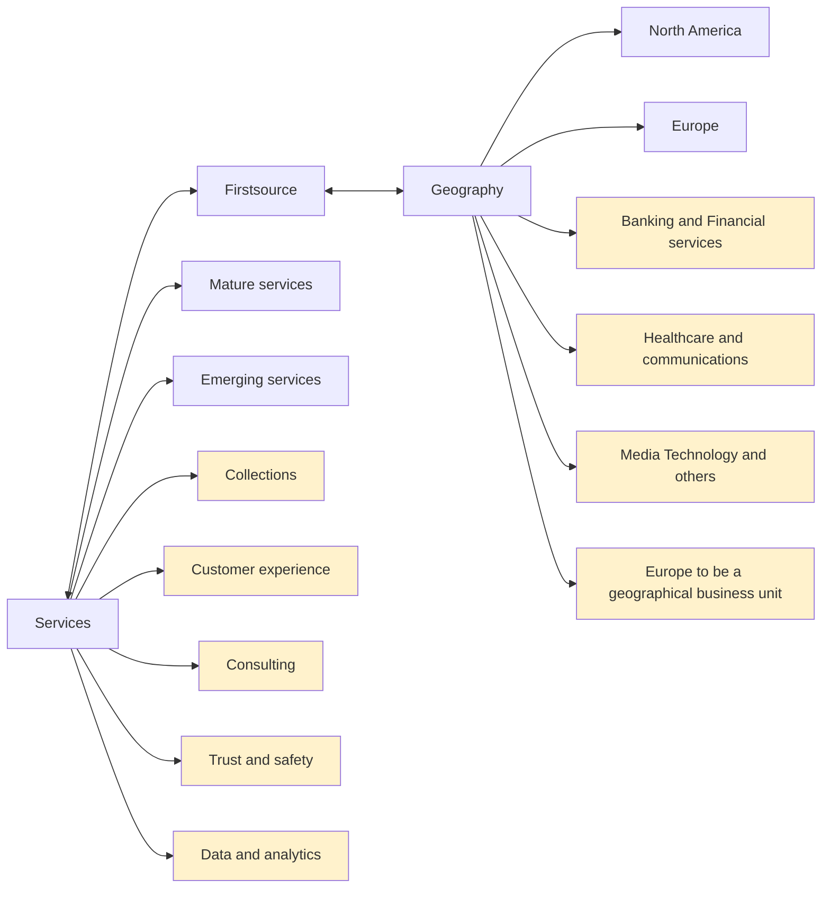

# Firstsource Business Structure

## Services

### Service Categories
- **Mature services**
- **Emerging services**

### Key Service Areas
- Collections
- Customer experience
- Consulting
- Trust and safety
- Data and analytics

## Geography

### Regional Presence
- **North America**
- **Europe**

### Industry Focus
- Banking and Financial services
- Healthcare and communications
- Media Technology and others

### Strategic Note
- Europe to be a geographical business unit
