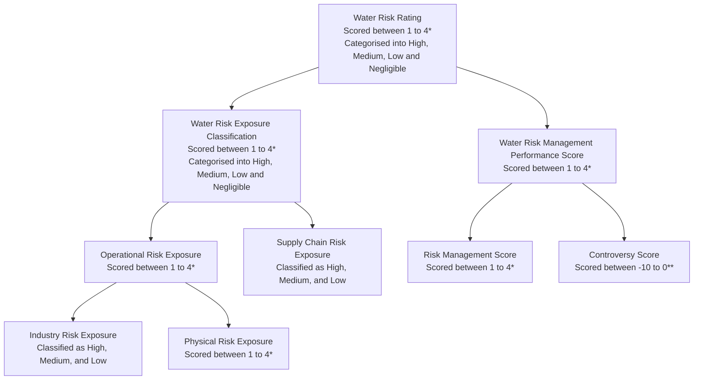

# Water Risk Rating System

```mermaid
flowchart TD
    A["Water Risk Rating<br/>Scored between 1 to 4*<br/>Categorised into High, Medium, Low and Negligible"] --> B["Water Risk Exposure Classification<br/>Scored between 1 to 4*<br/>Categorised into High, Medium, Low and Negligible"]
    A --> C["Water Risk Management Performance Score<br/>Scored between 1 to 4*"]
    
    B --> D["Operational Risk Exposure<br/>Scored between 1 to 4*"]
    B --> E["Supply Chain Risk Exposure<br/>Classified as High, Medium, and Low"]
    
    D --> F["Industry Risk Exposure<br/>Classified as High, Medium, and Low"]
    D --> G["Physical Risk Exposure<br/>Scored between 1 to 4*"]
    
    C --> H["Risk Management Score<br/>Scored between 1 to 4*"]
    C --> I["Controversy Score<br/>Scored between -10 to 0**"]
```

**Scale Notes:**
* Scale: 1-4 (1 = high risk / poor risk management)
** Scale: -10 to 0 (0 = no controversies)
